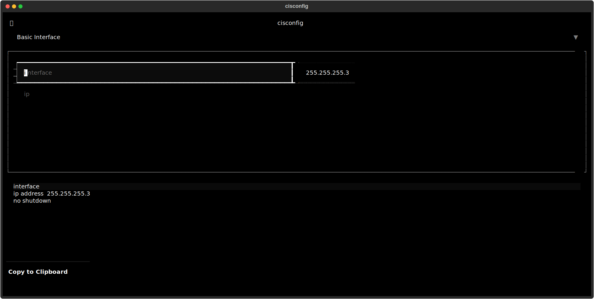
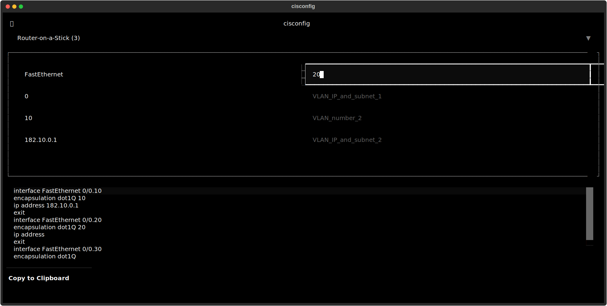

# cisconfig
Simple tool for generating CISCO packet tracer 'scripts' from templates.

## Installation
Make sure python is installed. Download/clone the repository and open it in cmd. Run:
```
python -m venv .venv
.venv\Scripts\activate
```
Inside the virtual environment, install dependencies:
```
pip install -r requirements.txt
```

## Run
To run, make sure the venv is open then run the py file.
```
.venv\Scripts\activate
python cisconfig.py
```

In the app, choose a template from the drop-down and fill in the fields. Click 'copy to clipboard' at the bottom and paste into packet tracer. All scripts assume being run from the (config) terminal (i.e. after 'conf t')

The the output at the bottom can be edited as you like to remove/add/change individual lines. Remember this will be deleted when the template is changed however.

## Screenshots

